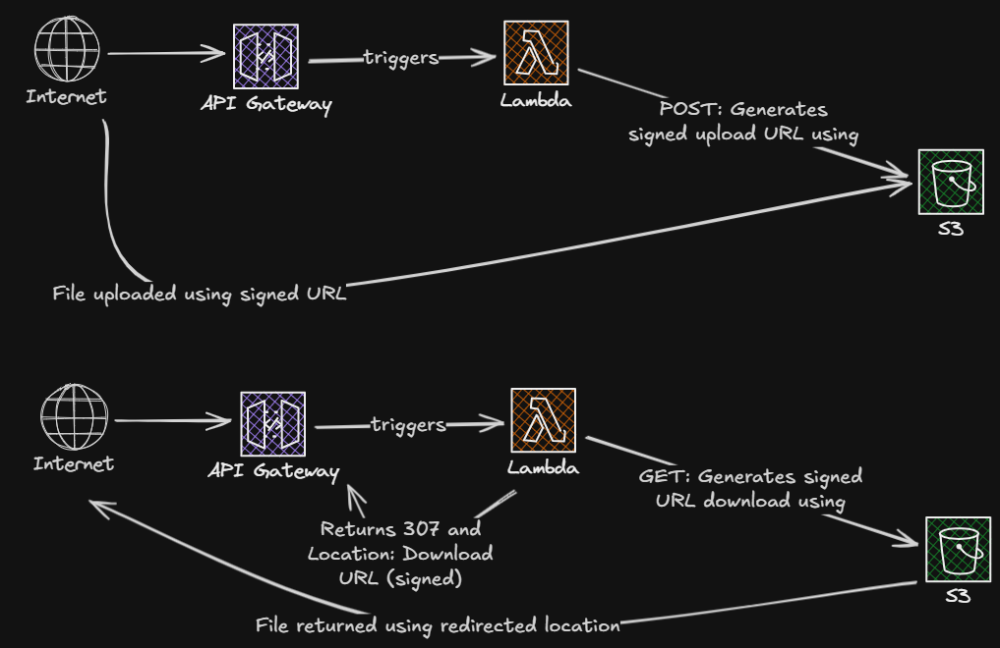

# File Gateway Service

A simple, secure file gateway service using AWS SAM, API Gateway, Lambda, and S3.

## Architecture

- **API Gateway**: Exposes REST endpoints.
- **Lambda**: Handles logic to generate presigned URLs.
- **S3**: Stores the files privately.

### Architecture Diagram



### Lambda Layer

Lambda layer is used to keep dependency management simple in case two lambda functions need to be used for uploading and downloading files in the future.

## API Endpoints

### 1. Upload File

**POST** `/files`

Request Body:

```json
{
  "filename": "example.txt"
}
```

Response:

```json
{
  "upload_url": "https://s3.amazonaws.com/...",
  "filename": "example.txt",
  "expires_in": 300
}
```

### 2. Download File

**GET** `/files/{key}`

Request Parameters:

- `key`: The key of the file to download.

Response:

It redirects (307) to a temporary presigned S3 URL. The status code 307 is preferred because it explicitly guarantees that the HTTP method (GET) remains unchanged when following the redirect. Additionally, it aligns with S3's own routing.
The response body is empty.

## Deployment

### Github Actions

The Github Actions workflow is defined in `.github/workflows/samcli.yaml`. It's triggered when a push is made to the `main` branch or manually.

It will build the application, deploy to AWS, and run the integration tests.

#### Github Actions Configuration

The Github Actions workflow is configured in `.github/workflows/samcli.yaml`. It uses the following environment variables:

- `AWS_OIDC_ROLE_ARN`: (Required) The ARN of the IAM role to assume for the Github Actions workflow. OIDC role must be created in AWS IAM.
  e.g. `arn:aws:iam::123456789012:role/MyOidcRole` where `123456789012` is your AWS account ID and `MyOidcRole` is the name of the role.
  More information here: https://docs.github.com/en/actions/how-tos/secure-your-work/security-harden-deployments/oidc-in-aws

- `STACK_NAME`: (Optional) The name of the CloudFormation stack. Default is `coderoad-lab-4-aprudencio`.
- `REGION`: (Optional) The AWS region where the stack is deployed. Default is `us-east-1`.

### Manual Deployment

1. Build the application:

   ```bash
   sam build
   ```

2. Deploy to AWS:
   ```bash
   sam deploy --guided
   ```

## Testing

You can use `curl` to test the endpoints.

### Manual testing

#### cURL

**Upload:**

```bash
# 1. Get upload URL
curl -X POST https://<api-id>.execute-api.<region>.amazonaws.com/Prod/files \
  -d '{"filename": "test.txt"}'

# 2. Upload file using the returned URL
curl -X PUT '<upload_url>' --upload-file test.txt
```

**Download:**

```bash
# Download file (follows redirect)
curl -L -O https://<api-id>.execute-api.<region>.amazonaws.com/Prod/files/test.txt
```

#### Postman

A Postman collection is provided in `docs/postman_collection.json`.
Just import it to Postman and replace the `{{generated API gateway URL}}` with your API gateway URL.

Then you can run the collection to test the endpoints. The upload URL will be populated automatically in the collection variables so you only need to choose a file to upload and run the upload request.

For the download request, you can just run it with the file name you want to download.

### Integration Tests

You can run the integration tests locally (requires AWS credentials). Ensure you are in the project root directory:

```bash
python tests/integration_test.py
```

#### Environment Variables

The integration tests require the following environment variables:

- `STACK_NAME`: The name of the CloudFormation stack.
- `REGION`: The AWS region where the stack is deployed.

You can set these variables in a `.env` file in the root directory of the project.

Example `.env` file:

```env
STACK_NAME=coderoad-lab-4-aprudencio
AWS_REGION=us-east-1
```

### Unit Tests

You can run the unit tests locally (mocks AWS services). Ensure you are in the project root directory:

```bash
python tests/unit_test.py
```
